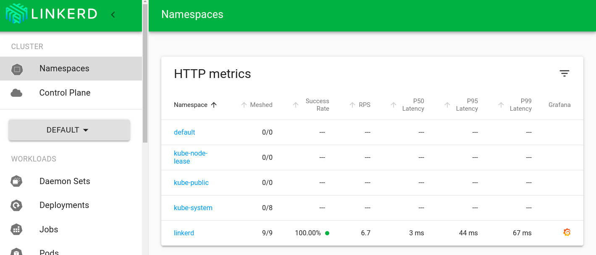

## Install LinkerD

https://linkerd.io/2.14/getting-started/

### Step 1: Install the CLI

```shell
curl --proto '=https' --tlsv1.2 -sSfL https://run.linkerd.io/install | sh
```

### Step 2: Validate your Kubernetes cluster

```shell
linkerd check --pre
```

### Step 3: Install Linkerd onto your cluster

```shell
linkerd install --crds | kubectl apply -f -
linkerd install | kubectl apply -f -
# Or
linkerd install --set proxyInit.runAsRoot=true | kubectl apply -f -
```

### Step 4: Install the demo app

```shell
curl --proto '=https' --tlsv1.2 -sSfL https://run.linkerd.io/emojivoto.yml \
  | linkerd inject - \
  | kubectl apply -f -
```

Install from local

```shell
linkerd inject - | kubectl apply -f emojivoto/emojivoto.yml
```

or With Emoji installed and running, we’re ready to mesh it, We can do this on a live application without downtime

```shell
kubectl get -n emojivoto deploy -o yaml \
  | linkerd inject - \
  | kubectl apply -f -
```

Forward web-svc locally to port 8080 by running:

```shell
kubectl -n emojivoto port-forward svc/web-svc 8080:80
```

Check your data plane with:

```shell
linkerd -n emojivoto check --proxy
```

Now visit http://localhost:8080


### Step 5: Explore Linkerd!

```shell
linkerd viz install | kubectl apply -f - # install the on-cluster metrics stack
```

Once you’ve installed the extension

```shell
linkerd check
```

Linkerd! Access the dashboard with:

```shell
linkerd viz dashboard &
```

